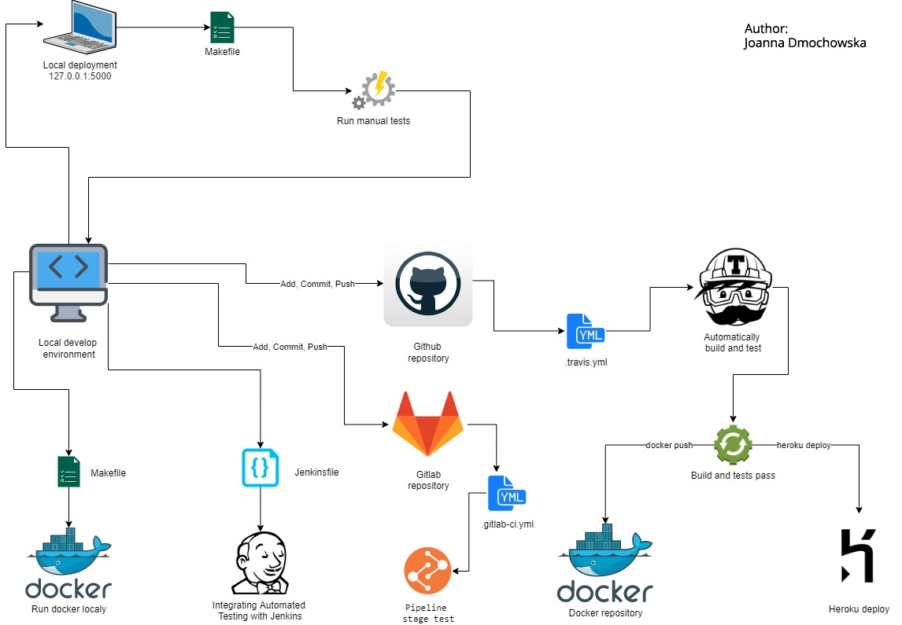

NIP, Regon, Pesel Validator
================

[](https://travis-ci.com/JDmocho/Flask_NIP_Regon_Pesel)

<a href="https://www.statuscake.com" title="Website Uptime Monitoring"></a>

### Features

Python module validating polish numbers - NIP, Regon, Pesel. 
Implementation in Flask with Continuous Integration, Continuous Delivery i Continuous Deployment.

### Environment

   - python 3.6.9
   - pip 20.1.1
   - flask 1.1.2
   - pytest 5.4.3
   - flake8 3.8.3
   - pytest-cov 2.10.0
   - gunicorn 20.0.4
   - docker 19.03.12

### Installation

##### Ubuntu:

Installation python virtualenv i virtualenvwrapper:

```
$ sudo pip install virtualenv
$ sudo pip install virtualenvwrapper
```

Install docker: https://docs.docker.com/engine/install/ubuntu/


##### Centos:

Installation python virtualenv i virtualenvwrapper:

```
$ yum install -y python-pip
$ pip install -U pip
$ pip install virtualenv
$ pip install virtualenvwrapper
```

Install docker: https://docs.docker.com/engine/install/centos/


### Prepering environment:

```
virtualenv  nip-regon-pesel-validator
source ./nip-regon-pesel-validator/bin/activate
```

```
pip install -r requirements.txt
```

or

```
make deps
```

Deactivating the environment:

```
deactivate
```


### Run application

Run application more efficiently with makefile. The make utility requires a file, Makefile (or makefile), which defines set of tasks to be executed.

- **Run Flash App**

  `make run`
  
  You can acces on 127.0.0.1:5000

- **Runing tests**

   ```
   make lint
   make test
   make test_cov
   make test_smoke
   ```

   More about test you can read in file _process_todo.md_
 
 - **Docker**

    ```
    $ make docker_build
    $ make docker_run
    $ make docker_stop
    $ make docker_push
   
 - **Jenkins Installation**

   Jenkins provides hundreds of plugins to support building, deploying and automating any project.
 
   ```
   git clone https://github.com/JDmocho/Docker-Jenkins
   make build_jenkins
   make run_jenkins
   ```
   You can access Jankins on 127.0.0.1:8080
   
   Password you can find here:
   
   `make show_me_password`


- **Travis Integration**:

    The simplest way to test and deploy our project is to use Travis CI.
    Easily sync our project with Travis CI and you'll be testing your code in minutes.
    More info in _.travis.yml_ file


- **Deploy on Heroku**

    Heroku is a cloud platform that lets you build, deliver, monitor and scale apps. The fastest way to go from idea to URL, bypassing all those infrastructure headaches.
    You can access:  https://flask-nip-regon-pesel.herokuapp.com/
    
- **Docker Image**    
    
     Check docker hub: 
     https://hub.docker.com/repository/docker/jdmocho/flask_nip_regon_pesel
     
## Continuous Deployment procces description

